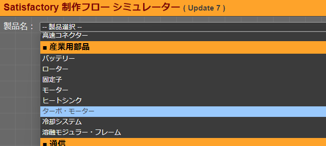
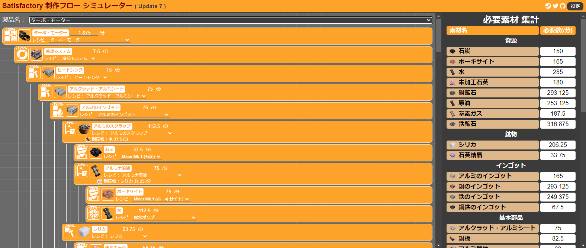
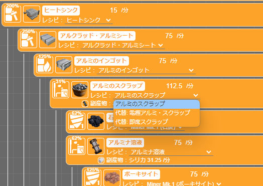
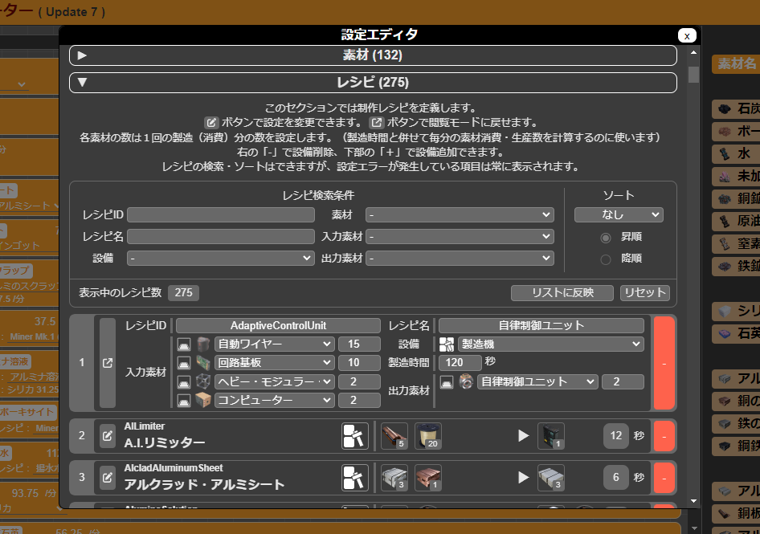

# Satisfactory Flow Simulator

工場建設ゲーム Satisfactory 用思考補助ツール。

製作フローを可視化し、製作に必要な素材や資源が最終的にどれだけ必要になるかを確認する目的で作成。

## 使い方

本ツールのページ(https://kanamechanlover.github.io/SatisfactoryFlowSimulator/ )を開き、  
上部の製品選択プルダウンから製品を選択することで、  
各素材の製作工程で設備の稼働率や必要になる素材等を確認できる。

製品選択直後はすべてデフォルトのレシピとなっており、製作フローツリー上でレシピを個別に変更できる。

## 補足

### 設定が最新になっていない場合

`/assets/config/config.json` に素材やレシピの情報をまとめているが、  
ゲーム側の更新後しばらくは最新版のモノになっているとは限らない為注意。

その場合は、画面右上の「設定」ボタンから設定エディタを開き、最新と異なる部分を変更できる。

